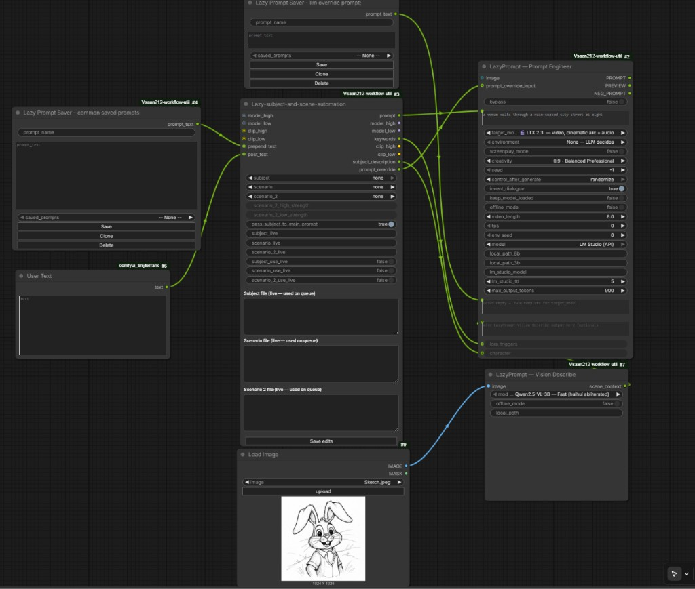

# Vsaan212-workflow-utilities

ComfyUI custom nodes: selectors, dual-stack subject/scene automation, text utilities, optional LoRA bypass, prompt library, **Lazy Image Loader**, and **LazyPrompt** (multi-target prompt engineer + optional vision). MIT licensed.

## Nodes (summary)

| Node | What it does | Full guide |
|------|----------------|------------|
| **Subject Selector** | Load `.txt` from `subjectselector/SubjectFiles/` (recursive). | [docs/nodes/subject-selector.md](docs/nodes/subject-selector.md) |
| **Scenario Selector** | Load `.txt` from `scenarioselector/ScenarioFiles/` (recursive). | [docs/nodes/scenario-selector.md](docs/nodes/scenario-selector.md) |
| **Lazy-subject-and-scene-automation** | One node: **one subject** + **two scenario** files (up to 6 scenario LoRA sets), **`model_high`** / **`clip_high`** required (single-model **Z-Image**, **Krea2**, Flux, etc.) or full Wan-style **high/low** dual stack when **`model_low`** / **`clip_low`** are wired. **`prompt`**, **`keywords`**, **`subject_description`**, **`prompt_override`**. **Live editors** on the node (queue uses pane text, not disk); **Save edits** to `.txt`; **scenario 2 strength** sliders override `[LoraHighA]` / `[LoraLowA]` model strength. Uses **`lazy_subject_scene_automation/SubjectFiles`** and **`…/ScenarioFiles`**. | [docs/nodes/lazy-subject-scene-automation.md](docs/nodes/lazy-subject-scene-automation.md) |
| **Text Split** | Split by separator, regex, or **tagged format** (`[Tag]` headers). **Auto-detects** v2 subject/scenario files when the first line is `[LoraHighA]`; otherwise **`tagged_format`** or separator `#` for legacy graphs. | [docs/nodes/text-split.md](docs/nodes/text-split.md) |
| **Optional Switch LoRA** | Apply a LoRA or pass through when path is `bypass` / empty. | [docs/nodes/optional-switch-lora.md](docs/nodes/optional-switch-lora.md) |
| **Lazy Prompt Saver** | Save / clone / delete named prompts in `lazy_prompts.json`. | [docs/nodes/lazy-prompt-saver.md](docs/nodes/lazy-prompt-saver.md) |
| **Lazy Image Loader** | Load from `input/`: browse, drag-and-drop upload, open input folder, **cover crop** to popular ratios (default **9:16**), live drag-to-position preview. | [docs/nodes/lazy-image-loader.md](docs/nodes/lazy-image-loader.md) |
| **LazyPrompt** | Prompt Engineer (LTX / Wan / Flux / SDXL / Pony / SD 1.5), Vision Describe (Qwen2.5-VL), Unload local model. LM Studio API uses native `/api/v1/chat` with OpenAI fallback. | [docs/nodes/lazyprompt.md](docs/nodes/lazyprompt.md) |

**Documentation index:** [docs/README.md](docs/README.md)

## Installation

### Via Comfy Registry (recommended)
Search for **`vsaan212/Vsaan212-workflow-utilities`** in the ComfyUI Manager and click **Install**.

### Manual (development)
Clone into your Comfy install:

<ComfyUI root>/
└─ custom_nodes/
└─ vsaan212_workflow_utilities/ # this repo's custom_nodes/* contents

Restart ComfyUI.

## Folder layout & auto-creation

On first load the pack creates missing folders as needed.

**Standalone selectors**

```
custom_nodes/vsaan212_workflow_utilities/
├─ scenarioselector/ScenarioFiles/
└─ subjectselector/SubjectFiles/
```

**Lazy-subject-and-scene-automation** (separate library)

```
custom_nodes/vsaan212_workflow_utilities/
└─ lazy_subject_scene_automation/
   ├─ ScenarioFiles/
   └─ SubjectFiles/
```

Put `.txt` files under the folder that matches the node you use. Dropdowns show **relative paths without `.txt`** (POSIX-style); nested subfolders are supported.

**Subject & scenario file formats (selectors + Text Split)**

- **Tagged (current):** sections start with a `[Tag]` line (e.g. `[LoraHighA]`, `[desciption]`), body on following lines until the next tag. Shipped examples: `Bypass and format example.txt`, `none.txt`.
- **Legacy:** sections separated by a line containing only `#` (blank line, `#`, blank line).

**Lazy-subject-and-scene-automation** parses tagged files internally. The browser extension **`js/lazy_subject_scene_live.js`** adds editable **subject / scenario / scenario 2** panes, **Save edits**, and **scenario 2 high/low strength** sliders (see [lazy-subject-scene-automation.md](docs/nodes/lazy-subject-scene-automation.md)). For **Subject Selector** / **Scenario Selector** → **Text Split**, v2 files (first line `[LoraHighA]`) split automatically; legacy `#` files use separator `#` unless you force **`tagged_format` ON**. Text Split details: [text-split.md](docs/nodes/text-split.md).

**Lazy Image Loader** reads from ComfyUI’s global **`input/`** folder (not a pack subfolder). Extension **`js/lazy_image_loader.js`** adds the preview, pan crop, upload, and **Open input folder** button. Details: [lazy-image-loader.md](docs/nodes/lazy-image-loader.md).

## Example workflow (Lazy automation + LazyPrompt)

This pack is meant to replace long chains of selector + LoRA + text nodes with **one automation node** plus **LazyPrompt** for LLM expansion. The screenshot below is a typical LTX / LM Studio graph:



Full node reference: [lazy-subject-scene-automation-workflow.md](docs/workflows/lazy-subject-scene-automation-workflow.md) · [lazyprompt.md](docs/nodes/lazyprompt.md)

### How to wire it

**1. Lazy-subject-and-scene-automation (center)**  
- Connect **`model_high`** and **`clip_high`** (required). For **single-model** graphs (**Z-Image**, **Krea2**, one Flux/SDXL branch, etc.), leave **`model_low`** / **`clip_low`** unwired and use **`model_high`** / **`clip_high`** outputs downstream. For **Wan-style dual stacks**, also wire **`model_low`** / **`clip_low`** in and out.  
- Pick **`subject`**, **`scenario`**, and optional **`scenario_2`** from the dropdowns (`.txt` under `lazy_subject_scene_automation/SubjectFiles` and `…/ScenarioFiles`).  
- Edit the **live** panes on the node; queue uses that text (not necessarily disk). Use **Save edits** to write back to `.txt`.  
- Optional **`prepend_text`** / **`post_text`**: wire STRING inputs (e.g. **Lazy Prompt Saver** for a saved prefix, **User Text** or any string node for postfix).  
- Outputs **`model_high`** / **`clip_high`** (and optional **`model_low`** / **`clip_low`**), **`keywords`**, **`prompt`**, **`subject_description`**, and **`prompt_override`** go to the rest of your graph.  
- Output **`prompt_override`**: wire when a scenario file uses a **`[Prompt]`** block (see below).  
- **Single-model LoRA tip:** put LoRAs on **High** slots (`LoraHighA`, …) or set **Low** slots to `bypass` — the low branch is skipped when **`model_low`** / **`clip_low`** are not connected.

**2. LazyPrompt — Prompt Engineer (LLM)**  
- **`user_input`**: your rough idea (or leave minimal when override carries the scene).  
- **`prompt_override_input`** ← **`prompt_override`** from the automation node when the scenario file defines **`[Prompt]`** instead of **`[desciption]`**. When connected/non-empty, this **replaces `user_input`** for the LM Studio / local HF request. You can also wire a **Lazy Prompt Saver** here for a fixed override string.  
- **`character`** ← **`subject_description`** from the automation node so the subject file’s **`[desciption]`** always reaches the LLM (including when **`prompt_override_input`** is set).  
- **`scene_context`** ← **LazyPrompt — Vision Describe** (or paste text manually).  
- **`image`**: optional reference frame for **LM Studio (API)** with a vision model loaded.  
- Set **`target_model`**, **`model`** (e.g. **LM Studio (API)**), **`lm_studio_model`**, and token/temperature as needed.  
- Use output **`PROMPT`** downstream (encode, preview, etc.).

**3. LazyPrompt — Vision Describe (optional)**  
- **`image`** ← **Lazy Image Loader** or **Load Image** (or any IMAGE output).  
- **`scene_context`** → Prompt Engineer **`scene_context`** (or use **`character`** for subject-file text from automation).  
- Run once per reference frame; caption text steers the LLM without inventing the subject from scratch.

**4. Scenario file tips for this graph**  
- **`[desciption]`** → merged into automation **`prompt`** (CLIP-side text).  
- **`[Prompt]`** → sent on **`prompt_override`** only (LLM path); mutually exclusive with **`[desciption]`** in the same file.  
- **`{left|right}`** in scenario text → random choice each queue run.  
- **`scenario_2`** + strength sliders → second scenario LoRA set and tunable `[LoraHighA]` / `[LoraLowA]` model strength.

**5. Lazy Prompt Saver (optional)**  
- Saved snippets for **`prepend_text`**, manual **`prompt_override_input`**, or ad-hoc **`user_input`** copy/paste — not required if you only use live editors and scenario files.

## Python dependencies

Install from `requirements.txt` if your ComfyUI environment is missing anything (`transformers`, `torch`, `qwen-vl-utils`, `Pillow`, `numpy`, etc.).

## Credits

**LazyPrompt** in this pack reuses and adapts MIT-licensed community work. Thank you to the original authors:

- **LoRa-Daddy** — *LTX-2 Easy Prompt* (**LTX2EasyPrompt-LD**): cinematic LTX-style expansion, Qwen2.5-VL → `scene_context`, negative hints, LoRA triggers, dialogue / bypass, frame pacing, local Hugging Face + **LM Studio** patterns, output cleaning. LazyPrompt’s **Prompt Engineer** and **Vision Describe** descend from that design.
- **seanhan19911990-source** — MIT-licensed **LTX2EasyPrompt-LD** tree (copyright in that project’s `LICENSE`); original upstream listing may no longer be on GitHub.
- **Brojakhoeman** — MIT **Gemma4Prompt** (copyright in that project’s `LICENSE`): per-target system prompts (LTX 2.3, Wan 2.2, Flux.1, SDXL, Pony XL, SD 1.5), LTX screenplay variant, and **environment presets** merged into LazyPrompt.

**vsaan212** maintains this integrated repository (selectors, lazy subject/scene automation, Lazy Prompt Saver, LazyPrompt merge, and packaging) separately from those upstreams.

## Troubleshooting

- **New `.txt` files not in dropdown:** Press **`R`** in ComfyUI or recreate the node. Lazy-subject-and-scene-automation also refreshes via `/vsaan212/lazy-subject-scene/…` when the node is created.
- **Same filename in two folders:** Use the full relative path in the dropdown.
- **Line endings:** Nodes normalize `\r\n` / `\r` to `\n`.
- **Lazy Image Loader missing from menu:** Restart ComfyUI after updating the pack; node is under **`vsaan212/lazy`**.

## License
MIT (see `LICENSE`)
