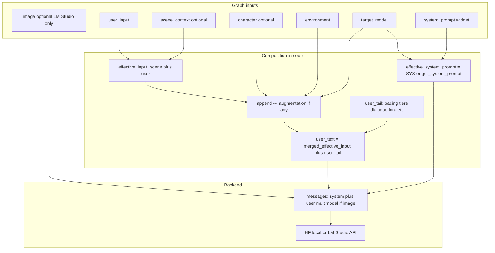

# LazyPrompt — Prompt Engineer: how enhancement and system override work

This document describes **LazyPrompt — Prompt Engineer** (`LazyPromptEngineer`): how your idea becomes the final LLM request, what counts as “prompt enhancement,” and how the **`system_prompt`** text field overrides (or restores) the built-in templates.

For install, wiring, and Vision Describe, see [lazyprompt.md](lazyprompt.md).

Default templates are edited in **`lazyprompt/system_prompts.json`** (inside the custom node pack, next to `system_prompts.py`). After editing, **restart ComfyUI** or press **R** (refresh) so Python reloads the file.

---

## High-level flow

Each run (when **`bypass`** is off) builds an OpenAI-style chat payload:

1. **System message** — either your **`system_prompt`** text (if non-empty after trim) or the **JSON template** chosen from **`target_model`** (and **`screenplay_mode`** for LTX). The **`None`** target loads no template (empty system unless you use override).
2. **User message** — your scene/instruction text plus every **dynamic enhancement** appended at the end (pacing, content tier, dialogue rules, LoRA order, environment block, etc.).

When **[minimal mode](#minimal-mode)** applies (`None` target **and** **`system_prompt`** filled), the **user** message is scene + idea only (no augmentation tail). **Otherwise**, the LLM receives the full composed **user** string with enhancements (unless **`bypass`** is on — then no LLM runs; see [Bypass](#bypass-mode)).



---

## 1. Auto system prompt (default)

If **`system_prompt`** is empty or only whitespace, the node sets:

```text
effective_system_prompt = get_system_prompt(target_model, screenplay_mode)
```

Templates are loaded from **`lazyprompt/system_prompts.json`** (keys below). Edits require restart or **R**.

Routing (substring match on **`target_model`** labels):

| `target_model` | System template key |
|----------------|---------------------|
| **`None`** (first dropdown entry) | *(empty string — no template)* |
| `LTX` + **`screenplay_mode`** true | `ltx_23_screenplay` |
| `LTX` | `ltx_23` |
| `Wan` | `wan_22` |
| `Flux` | `flux` |
| `SDXL` | `sdxl` |
| `Pony` | `pony` |
| `SD 1.5` | `sd15` |
| (unrecognized label) | **`flux`** fallback if present |

Those templates define output shape (e.g. Wan 80–120 words, SDXL `POSITIVE:` / `NEGATIVE:` blocks, LTX audio layers).

### Minimal mode

When **`target_model`** is **`None`** **and** **`system_prompt`** has text:

- **System message** = only that override text (same as other overrides).
- **User message** = scene + **`user_input`** only (including the Vision Describe wrapper if **`scene_context`** is wired). **No** `---` augmentation block, **no** pacing/tier/dialogue/LoRA tail — only what you typed for the idea (and optional scene context).

When **`target_model`** is **`None`** **and** **`system_prompt`** is empty: system message is empty and the **full** augmentation path runs (environment, pacing, tiers, etc.), same as any other target with an empty override.

---

## 2. System prompt override (the multiline text widget)

### What “override” means

If **`system_prompt`** has **any non-empty content after `.strip()`**, the node uses **exactly that string** as the system message (for **any** `target_model`, including **`None`**):

```text
effective_system_prompt = system_prompt.strip()
```

The JSON template for the current **`target_model`** is **not** merged, prepended, or appended. You are fully responsible for format and content.

For **`None`** + non-empty override, see [minimal mode](#minimal-mode): the **user** side also drops automatic augmentation so only your override + idea drive the LLM.

### What still applies when you override

Unless **[minimal mode](#minimal-mode)** applies (`None` target **and** override text), with a custom system prompt the node **still**:

- Appends the **augmentation** block from `build_prompt_augmentation` (video length arcs, environment preset lines, character hints, I2V / reference lines) to the **user** message, after a `---` separator (when that block is non-empty).
- Appends the **dynamic `user_tail`** to the **user** message: pacing / token soft targets for video, content-tier instructions (explicit / sensual / neutral), numbered-step enforcement, “no invented people” when no person tokens detected, multi-subject spatial instructions, dialogue instructions (video + `invent_dialogue`), LoRA trigger ordering, etc.

So override replaces **only** the system-role instructions, not the runtime “injections” in the user message.

### What stops applying (or is bypassed logically)

- **`screenplay_mode`** no longer switches JSON-backed system text **unless** you replicate that yourself in the override field — the router `get_system_prompt(..., screenplay_mode)` is skipped when override is non-empty.
- Target-specific wording from **`system_prompts.json`** is gone unless you paste it into **`system_prompt`**.

### Clearing the override in the UI

The extension `js/lazyprompt.js` adds:

- A context menu item: **Use auto system prompt (clear override)**.
- A button: **Auto system prompt (clear override)**.

Both set the widget value to `""` so the node returns to **`get_system_prompt`** behavior.

Whitespace-only text counts as empty after trim and falls back to auto.

---

## 3. User message composition (“prompt enhancement”)

Enhancement is everything that turns **`user_input`** into **`user_text`** before the model runs.

### Step A — `effective_input`

1. **Without `scene_context`:** `effective_input = user_input.strip()`.
2. **With `scene_context`:** the vision (or manual) description is wrapped as authoritative scene text; **`user_input`** is framed as direction/mood/action layered on top:

   - Labeled blocks tell the model not to contradict the scene description.

### Step B — `build_prompt_augmentation(...)`

Called with **`target_model`**, **`environment`**, **`frame_count` / `fps`** (from **`video_length`** and **`fps`** for video targets), **`character`**, **`env_seed`**, **`screenplay_mode`**, and whether visual context exists (`scene_context` or LM Studio + **`image`**).

It may append:

- **VIDEO LENGTH** — sentence-count / beat-count guidance scaled to duration; Wan gets a fixed “80–120 words” line; LTX screenplay mode gets different arc text than standard LTX.
- **IMAGE / SCENE CONTEXT** — I2V-style grounding when visual context is present (wording differs for Wan vs other video vs image targets).
- **ENVIRONMENT** — location, lighting, and (for video) sound from presets; **Random** uses **`env_seed`** (0 = different pick each run).
- **CHARACTER** — how to use the **`character`** string (tags vs prose depends on target).
- **AUDIO** — extra reminder for LTX (model has audio).

If any of that is produced, it is concatenated after:

```text
effective_input + "\n\n---\n" + augmentation
```

### Step C — `user_tail` (when not bypassing and not minimal mode)

These are **separate bracketed instructions** concatenated after `effective_input` (and augmentation). They depend on **`user_input`**, **`scene_context`**, **`target_model`**, **`video_length`**, **`fps`**, **`invent_dialogue`**, **`lora_triggers`**, etc. Highlights:

| Block | Role |
|-------|------|
| **Pacing / length** | Video: derives action count from duration, adds “HARD STOP” style pacing and soft token target; image: short format reminder. |
| **Content tier** | Scans **`user_input`** for explicit vs sensual vs neutral keywords; adds NSFW / undressing / age rules accordingly. |
| **Sequence** | If two or more numbered steps detected, enforces order. |
| **No person** | If no person-like tokens in `user_input` + `scene_context`, forbids inventing characters. |
| **Multi-subject** | Spatial tracking if two+ people heuristics match. |
| **Dialogue** | Video only: invent vs user-only vs silent, tied to **`invent_dialogue`** and quotes in input. |
| **LoRA** | If **`lora_triggers`** set, instructs model to start output with those exact words. |

Final **`user_text`** = `effective_input` (with optional `---` augmentation) **+** `user_tail`.

---

## 4. Backends: same messages, different transport

- **LM Studio (API):** `messages` as JSON; optional **`image`** as a second part of the user message (`image_url` + text). Requires **`lm_studio_model`** filled in.
- **Local HF (8B / 3B):** same `messages` passed through `apply_chat_template` + `generate`. **`image`** is not sent; use Vision Describe → **`scene_context`** instead.

Post-processing (`_clean_output`, split `POSITIVE`/`NEGATIVE` for tag targets, negative prompt builder for video) runs on the decoded assistant text for both paths.

---

## 5. Bypass mode

When **`bypass`** is **true**:

- No LLM call; **`user_input.strip()`** is returned for both **`PROMPT`** and **`PREVIEW`**.
- **`NEG_PROMPT`** is still built with the video-oriented keyword heuristic (`_build_negative_prompt`), not the SDXL split logic — so bypass is aimed at quick passthrough / debug, not full parity with normal **`target_model`** negative handling.

---

## 6. Implementation notes (common “it doesn’t work like I thought” cases)

1. **Templates on disk** — Editable defaults live in **`lazyprompt/system_prompts.json`**. Restart ComfyUI or press **R** after edits.

2. **Override vs `target_model`** — Changing **`target_model`** still changes augmentation, pacing, finalize/negative behavior, and dialogue/video detection — **except** in **[minimal mode](#minimal-mode)** (`None` **and** override text), where the automatic **user** tail is omitted.

3. **Minimum new tokens (local HF only)** — Local generation uses a computed **`min_new_tokens`**. That can encourage padding if the model would naturally stop sooner; LM Studio path does not use that parameter.

4. **Flux default** — If **`target_model`** ever fails to match known labels, **`get_system_prompt`** falls back to the **`flux`** entry in **`system_prompts.json`** when present.

5. **PREVIEW vs PROMPT** — After a normal run, both outputs are the same cleaned positive string; **`NEG_PROMPT`** carries the derived negative (or split from model for tag targets).

---

## 7. File map

| Concern | Location |
|---------|----------|
| Node UI, `generate`, message assembly, cleaning | `lazyprompt/lazy_prompt_engineer.py` |
| Per-target template router + **`None`** handling | `lazyprompt/system_prompts.py` |
| **Editable default system prompts** | **`lazyprompt/system_prompts.json`** |
| Environment + duration + character augmentation | `lazyprompt/message_builder.py` |
| Environment preset table | `lazyprompt/environment_presets.py` |
| Clear override button / menu | `js/lazyprompt.js` |

---

## See also

- [lazyprompt.md](lazyprompt.md) — node list, wiring, Vision Describe, LM Studio **`image`** pin.
- [text-split.md](text-split.md) — splitting long **`PROMPT`** outputs for encoders.
