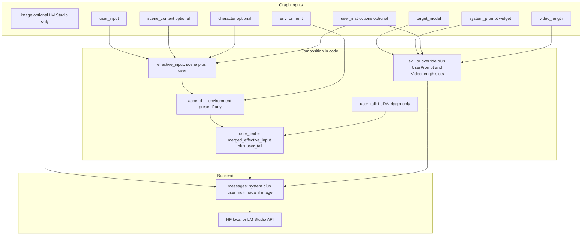

# LazyPrompt — Prompt Engineer: how enhancement and system override work

This document describes **LazyPrompt — Prompt Engineer** (`LazyPromptEngineer`): how your idea becomes the final LLM request, what counts as “prompt enhancement,” and how the **`system_prompt`** text field overrides (or restores) the built-in skill templates.

For install, wiring, and Vision Describe, see [lazyprompt.md](lazyprompt.md).

Default templates are edited in **`lazyprompt/Model_Skills/*.md`**. After editing or adding a skill file, **restart ComfyUI** or press **R** (refresh) so Python rescans the folder. The **`target_model`** dropdown is built from each file’s header (`Model Name` + `Media Type`, icon from `Model Type`).

---

## High-level flow

Each run (when **`bypass`** is off) builds an OpenAI-style chat payload:

1. **System message** — either your **`system_prompt`** text (if non-empty after trim) or the **Model_Skills** template for **`target_model`**. Runtime slots in that template are filled: **`user_instructions`** → `***UserPrompt***`; **`video_length`** → `***VideoLength***` (stripped for image skills or empty slots). The **`None`** target loads no template (empty system unless you use override).
2. **User message** — scene/character/instruction layers, optional environment-preset facts, and optional LoRA trigger order. People, timeline, duration policy, and content tone are **not** appended here — they belong in the skill MD.

When **[minimal mode](#minimal-mode)** applies (`None` target **and** **`system_prompt`** or **`prompt_override_input`** filled), the **user** message is override/idea only (no environment block, no LoRA tail). **Otherwise**, the LLM receives the composed **user** string (unless **`bypass`** is on — then no LLM runs; see [Bypass](#bypass-mode)).



---

## 1. Auto system prompt (Model_Skills)

If **`system_prompt`** is empty or only whitespace, the node sets:

```text
effective_system_prompt = apply_skill_runtime(
    get_system_prompt(target_model),
    user_instructions=user_instructions,
    video_length_sec=video_length if video skill else 0,
)
```

Each skill is one Markdown file under **`lazyprompt/Model_Skills/`**. Header schema:

```text
===Header===
Model Type: Video
Model Name: LTX 2.3
Media Type: Video; Cinematic Arc + Audio
Is Video: true
Has Audio: true
Prompt:
<system prompt body including ***UserPrompt*** and ***VideoLength*** markers>
```

| Field | Role |
|-------|------|
| **Model Type** | Icon for the dropdown (`Video` / `Image` / `Sound`) |
| **Model Name** | Display name |
| **Media Type** | Short subtitle in the dropdown |
| **Is Video** | Fills `***VideoLength***` from the node’s **`video_length`** (seconds). Image skills strip that slot. |
| **Has Audio** | Skill metadata (dialogue/audio policy belongs in the Prompt body) |
| **Prompt** | Full system template body — this is what the LLM follows |

Authoring a custom skill: copy an existing `.md`, change the header, and edit **SCENE POLICY**, output format, `***VideoLength***`, and `***UserPrompt***`. Prompt Engineer does **not** inject extra people/pacing/content-tier instructions outside that file.

Variants (Dialog, Screenplay, etc.) are **separate skills**, not UI toggles. Example files: `LTX_2.3.md`, `LTX_2.3_Dialog.md`, `MiniMax_H3_TR2V.md`, `Wan_2.2.md`, `Flux.1.md`, …

### Minimal mode

When **`target_model`** is **`None`** **and** either **`system_prompt`** or **`prompt_override_input`** has text:

- **System message** — `system_prompt` if set (still with UserPrompt / VideoLength slots), otherwise empty.
- **User message** — scenario override or **`user_input`** only (including the Vision Describe wrapper if **`scene_context`** is wired). **No** environment block, **no** LoRA tail.

When **`target_model`** is **`None`** and both **`system_prompt`** and **`prompt_override_input`** are empty: environment preset facts still append if an environment is selected.

---

## 2. System prompt override (the multiline text widget)

### What “override” means

If **`system_prompt`** has **any non-empty content after `.strip()`**, the node uses **exactly that string** as the system message base (for **any** `target_model`, including **`None`**). The Model_Skills body is **not** merged. Runtime slots (`***UserPrompt***`, `***VideoLength***`) still apply on that base if the markers are present.

### `user_instructions` (optional input)

Wire a text node to **`user_instructions`** (`forceInput`, no display widget).

| Input | Behavior |
|-------|----------|
| Empty | Entire `***UserPrompt***` … `***UserPromptEnd***` section is **removed** — nothing passed |
| Non-empty | Text is placed between the markers (markers kept). If markers are missing, a standard block is appended. The same text is also copied into the **user** message as locked scene facts. |

Default skill MD files document that populated UserPrompt text is mandatory.

### `***VideoLength***` slot

For **video** skills, Prompt Engineer writes the node’s **`video_length`** (e.g. `10s`) between `***VideoLength***` … `***VideoLengthEnd***`. Image skills and empty slots strip the whole CLIP DURATION SLOT section. Timing / enhance rules stay in the skill’s **SCENE POLICY** — PE does not add `[PACING]` or `[ENHANCE MODE]` to the user message.

### What still applies when you override

Unless **[minimal mode](#minimal-mode)** applies, with a custom system prompt the node **still**:

- Appends optional **environment** preset facts after `---` (location / lighting / sound).
- Appends a **LoRA trigger** line when **`lora_triggers`** is set.

People, numbered-step, content-tone, and timeline rules only apply if they are written in the override (or in the selected skill when you are not overriding).

Dialogue / screenplay formatting lives in the selected **skill MD**, not in `invent_dialogue` / `screenplay_mode` toggles (those widgets were removed).

### Clearing the override in the UI

The extension `js/lazyprompt.js` adds a context menu item and button to clear **`system_prompt`** back to auto (Model_Skills).

---

## 3. User message composition (“prompt enhancement”)

### Step A — `effective_input`

1. **Without extra layers:** `effective_input = user_input.strip()` (or **`prompt_override_input`** when set).
2. **With `scene_context` / `character` / `user_instructions`:** labeled layers (scene + subject + user instructions + user direction). SAS **`[video_length]`** (e.g. `12s`) stays in the user direction so the LLM can size beats. When that block is present, Prompt Engineer also fills the skill’s `***VideoLength***` slot from it; otherwise the node’s **`video_length`** widget is used.

People, timestamps, dialogue, and content-tone behavior are defined in the skill’s **SCENE POLICY**, not by extra PE user-message tags.

### Step B — `build_prompt_augmentation(...)`

Called with **`target_model`**, **`environment`**, and **`env_seed`**. It may append **ENVIRONMENT** facts (location, lighting, and sound for video skills) when a preset is selected. Duration, audio policy, and I2V grounding are **not** appended here.

### Step C — `user_tail`

Only the **LoRA trigger** line when **`lora_triggers`** is set. No pacing / enhance / no-person / age / sequence / content-tier blocks.

---

## 4. Backends: same messages, different transport

- **LM Studio (API):** `messages` as JSON; optional **`image`**. **`creativity`** is a float **0.1–1.0** (step 0.1); values above 1.0 are clamped (LM Studio rejects them).
- **Local HF (8B / 3B):** same `messages` via `apply_chat_template` + `generate`. **`image`** is not sent; use Vision Describe → **`scene_context`**.

---

## 5. Bypass mode

When **`bypass`** is **true**: no LLM call; effective user text is returned for **`PROMPT`** / **`PREVIEW`**.

In both bypass and normal runs, after the final Prompt text is ready, **`[LoraH]`** / **`[LoraL]`** / **`[Lora1]`**–**`[Lora5]`** blocks are applied to the matching optional model sockets and stripped from the string outputs.

---

## 6. Implementation notes

1. **Skills on disk** — Edit / add **`lazyprompt/Model_Skills/*.md`**. Restart or **R** after changes.
2. **Override vs `target_model`** — Changing skill still changes the system template, video vs image duration slot, and finalize/negative behavior (except minimal mode).
3. **Legacy workflows** — Old `screenplay_mode` / `invent_dialogue` / `fps` widgets are ignored; pick Screenplay or Dialog skills instead. Old creativity labels are coerced to floats (1.1 → 1.0).
4. **PREVIEW vs PROMPT** — Same cleaned positive string after a normal run; **`NEG_PROMPT`** carries the derived or split negative.
5. **Prompt LoRA tags** — Closed `[LoraH]` / `[LoraL]` / `[Lora1]`–`[Lora5]` in Prompt / LLM output only (not `[desciption]`). See [lazyprompt.md](lazyprompt.md#prompt-dynamic-lora-tags).

---

## 7. File map

| Concern | Location |
|---------|----------|
| Node UI, `generate`, message assembly, cleaning, Prompt LoRA parse | `lazyprompt/lazy_prompt_engineer.py` |
| Skill loader, header parse, UserPrompt / VideoLength slots, **`None`** | `lazyprompt/system_prompts.py` |
| **Editable skill system prompts (format + SCENE POLICY)** | **`lazyprompt/Model_Skills/*.md`** |
| User-message layers + environment preset facts | `lazyprompt/message_builder.py` |
| Environment preset table | `lazyprompt/environment_presets.py` |
| Clear override button / menu | `js/lazyprompt.js` |

---

## See also

- [lazyprompt.md](lazyprompt.md) — node list, wiring, Vision Describe, LM Studio **`image`** pin.
- [text-split.md](text-split.md) — splitting long **`PROMPT`** outputs for encoders.
