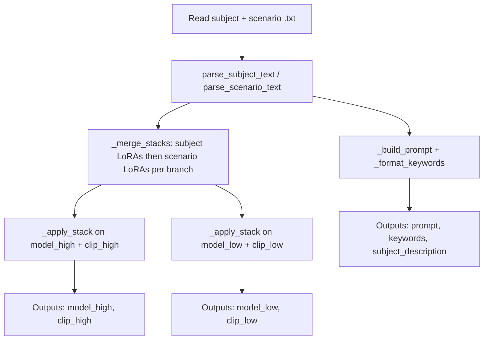

# Lazy Subject + Scene Automation — workflow guide

This document describes **how to use** the Lazy Subject + Scene Automation feature end-to-end, and **how the pieces fit together** in code (Python module, ComfyUI routes, and the browser extension). For full tag syntax, examples, and I/O tables, see [lazy-subject-scene-automation.md](../nodes/lazy-subject-scene-automation.md).

---

## What this feature does (one sentence)

You pick **subject** (optionally **subject_2** / **subject_3**), **scenario**, and optional **scenario_2** text files that declare LoRA stacks (with bypass), optional MiniMax **`[Refmod]`** rows, descriptions, and optional keywords; the node **merges** subject + both scenario stacks on each of two branches (**high** / **low**), **applies** them to paired MODEL + CLIP, and outputs a **composed prompt** plus **keywords**—without maintaining separate LoRA chains in the graph for every combination. The live extension lets you **edit pane text on queue**, **save to disk**, and tune **scenario 2** `[LoraHighA]` / `[LoraLowA]` model strength with sliders.

---

## Operator workflow (ComfyUI)

### 1. Prepare files on disk

- **Subjects:** `ComfyUI/lazynodes/lazy_subject_scene_automation/SubjectFiles/**/*.txt`
- **Scenarios:** `ComfyUI/lazynodes/lazy_subject_scene_automation/ScenarioFiles/**/*.txt`

These folders are **not** shared with the standalone Subject/Scenario Selector nodes; copy or symlink if you want the same content in both places.

### 2. Refresh lists when you add files

Dropdowns are built when the node is created or when the server refreshes lists (see [List refresh](#list-refresh)). After adding `.txt` files, press **`R`** in ComfyUI or recreate the node so new relative paths appear.

### 3. Wire the graph

1. **Wan:** two branches (high-noise / low-noise) into **`model_high`** / **`model_low`**. **MiniMax:** Switcher → **`minimax_model`**. **Image:** **`image_model`**. **LTX:** **`video_model`**.
2. Connect CLIP as needed (`clip_high` is the LoRA companion for singular models).
3. Choose **`subject`**, **`scenario`**, and optionally **`scenario_2`** from the dropdowns (values are relative paths **without** `.txt`). For MiniMax RefMods, set **`multisubject_refmod`** and optional extra subjects.
4. Set **`video_length`** for video graphs (0 skips). Optionally wire **`prepend_text`** and **`post_text`**.
5. Edit the **live** panes as needed; **queue uses pane text**. Use **Save edits** to persist to `.txt`. Adjust **scenario 2** strength sliders when a second scenario is selected.
6. Toggle **`pass_subject_to_main_prompt`** if you want the main **`prompt`** to omit the subject file’s description while still exposing it on **`subject_description`**.
7. Wire **`refmod`** → [Lazy-refmod-split](../nodes/lazy-refmod-split.md) → Load H3 RefMods when subject files include **`[Refmod]`**. Linked `mod_#` is empty until SAS runs; this pack patches Load H3 RefMods so that does not fail validation.

### 4. Use outputs downstream

| Output | Typical use |
|--------|----------------|
| `prompt` | CLIP encode, preview text, or text nodes that need the final assembled string. |
| `model_high` / `model_low` | Continue the sampling graph after merged LoRAs. |
| `clip_high` / `clip_low` | Same LoRA order as the paired model branch. |
| `keywords` | Trigger-style tags from subject then scenario `KeywordA`–`KeywordC` blocks, comma-separated with a trailing comma when non-empty. |
| `subject_description` | Raw subject-side description text only (no prepend/post); useful when `pass_subject_to_main_prompt` is off but you still need the subject text elsewhere. |
| `prompt_override` | Scenario **`[Prompt]`** text for LazyPrompt (see node doc); empty when scenarios use **`[desciption]`** only. |
| `selector` | MiniMax routing string (`[Workflow]`, reference image/audio paths) for Lazy MiniMax All-in-One; empty when those tags are absent. |
| `minimax_model` / `image_model` / `video_model` | Singular-model outputs after `VideoModelLora*` / `ImageModelLora*`. |
| `refmod` | Up to three MiniMax H3 RefMod rows; wire to **Lazy-refmod-split**. |

### 5. Live file preview (extension)

When the pack loads **`js/lazy_subject_scene_live.js`**, each **Lazy-subject-and-scene-automation** node shows:

- **Subject / scenario / scenario 2 (live)** — editable buffers; **queue uses this text** after you edit a pane.
- **Scenario 2 high/low strength** — float sliders between scenario 1 and scenario 2 panes; override `[LoraHighA]` / `[LoraLowA]` model strength in scenario 2 live text.
- **Save edits** — writes non-empty panes to the currently selected `.txt` files (one button, skips empty/`none` slots).

Changing **`subject`**, **`scenario`**, or **`scenario_2`** reloads from disk via **`read_pair`** (unless the workflow already had buffered live text).

---

## Execution flow (what happens on each run)

The node’s **`run`** method in `lazy_subject_scene_automation.py` follows this pipeline:

Optional **`prepend_text`**, **`post_text`**, and **`pass_subject_to_main_prompt`** feed **`_build_prompt`** only (they do not change LoRA stacks).

1. **Resolve paths** — `subject` (and `subject_2` / `subject_3` when **`multisubject_refmod`** is 2 or 3), `scenario`, and `scenario_2` relative paths; `none` or empty skips file read for that side. Randomize can pick several files from the same folder.
2. **Read UTF-8 text** — failures append to `preview_err` and are prefixed onto `prompt` and `subject_description` so you see load errors in the graph.
3. **Parse** — `parse_subject_text` and `parse_scenario_text` (twice when `scenario_2` is set) return `(high_stack, low_stack, description, keyword_list)` per file. Format is **v2 tagged** if any non-empty line starts with `[`; otherwise **v1** `#`-section legacy rules apply (different high/low mapping for scenario vs subject in v1). Subject **`[Refmod]`** is collected into the **`refmod`** blob; when **`multisubject_refmod` ≥ 1** those subjects skip LoRAs.
4. **Merge stacks** — `_merge_stacks` concatenates on each branch: **subject LoRAs** (1 then 2 then 3), then **scenario 1 LoRAs**, then **scenario 2 LoRAs** (up to six scenario slots when both scenario files use A/B/C).
5. **Apply** — `_apply_stack` walks the merged list with ComfyUI’s **`LoraLoader`**, resolving paths and registering custom LoRA directories when the path exists on disk.
6. **Compose text** — `_build_prompt` interleaves prepend, optional subject description in the main prompt (controlled by the boolean), post text, and scenario description with intentional newlines. `_format_keywords` merges keyword lists. Scenario **`{a|b|c}`** groups are expanded randomly per run in description, Prompt, and keyword bodies.

---

## List refresh

Lists of subjects and scenarios are refreshed when:

- **`INPUT_TYPES`** runs (node definition / refresh in ComfyUI), which calls `refresh_subjects_list` and `refresh_scenarios_list`.
- HTTP **`GET`** routes under `/vsaan212/lazy-subject-scene/` call the same refresh helpers (used by `js/selectors_refresh.js` and the live extension).

**Seeding:** On ComfyUI startup, `lazy_user_data.ensure_seeded` creates **`ComfyUI/lazynodes/`** if needed and copies missing shipped examples (and leftover files still in the pack folders) without overwriting. `_ensure_lazy_seed_txt_files` also writes `none.txt` / `Bypass and format example.txt` into the lazynodes SAS folders if those names are missing.

---

## Python module sections (`lazy_subject_scene_automation.py`)

Read top-to-bottom, the file groups into these **logical sections**:

| Section (approx. lines) | Responsibility |
|-------------------------|----------------|
| **Module docstring + imports** (1–16) | Describes Wan-style dual-stack purpose; imports `LoraLoader`, `model_management`. |
| **Types + constants** (17–27) | `ApplySlot` tuple type; `_LAZY_V2_STEM_TEMPLATE` for seed files. |
| **Path safety + I/O helpers** (52–106) | `_normalize_rel_no_ext`, `_is_safe_rel_under_root` (blocks `..`), `_read_txt_under_root`, `_ensure_lazy_seed_txt_files`. |
| **Tag normalization + bypass** (109–127) | `_norm_tag`, `_bypass_path`, `_parse_float` for tagged strengths. |
| **v1 legacy splitting** (130–133) | `_split_v1_sections` on `#`-only separator lines. |
| **v2 tagged parsing** (136–189) | `_is_tagged_format`, `_parse_tagged_blocks` → map of tag → `(body, model_strength, clip_strength)`. |
| **Slot extraction** (192–339) | `_slot_from_block`, `_block_first`, `_append_optional_pair`, `_append_optional_slot`, `_append_primary_subject`, `_append_primary_scenario`, `_subject_stacks_from_blocks`, `_scenario_stacks_from_blocks`, `_keywords_from_blocks`, `_description_from_blocks` — implements slot order, deprecated tag aliases, and Wan 2.1-style “high only” duplication to low with clip strength 1.0. |
| **Public parsers** (362–433) | `parse_subject_text` / `parse_scenario_text`: choose v2 vs v1, return stacks + description + keywords. |
| **Merge + apply** (436–460) | `_merge_stacks`, `_resolve_lora_name`, `_apply_stack` — sequential `LoraLoader.load_lora`. |
| **Prompt + keywords** (463–503) | `_format_keywords`, `_build_prompt` — human-readable spacing rules. |
| **`LazySubjectSceneAutomation` class** (506–796) | Class-level roots and rel path lists; **`refresh_*_list`** scanners; **`api_*`** for HTTP; **`INPUT_TYPES`** / **`run`** ComfyUI integration; **`NODE_*_MAPPINGS`**. |

---

## HTTP API and server integration

Routes are registered in the pack’s **`__init__.py`** when `LazySubjectSceneAutomation` imports successfully:

| Method | Path | Role |
|--------|------|------|
| `GET` | `/vsaan212/lazy-subject-scene/subjects` | Refresh + return sorted subject rel paths (no `.txt`). |
| `GET` | `/vsaan212/lazy-subject-scene/scenarios` | Same for scenarios. |
| `POST` | `/vsaan212/lazy-subject-scene/read_pair` | Body `subject`, `scenario`, optional `scenario_2`, `subject_2`, `subject_3` → file texts + errors (path-safe). |
| `POST` | `/vsaan212/lazy-subject-scene/save_live_files` | Writes non-empty `*_text` fields to the matching selected paths. |

---

## Browser extension (`js/lazy_subject_scene_live.js`)

| Piece | Behavior |
|-------|----------|
| **`fetchReadPair`** | POST `read_pair` when subject/scenario/scenario_2 changes; fills read-only textareas; shows errors inline. |
| **`buildLiveDom`** | Three editable text areas, scenario 2 strength slider host, status lines, **Save edits** button. |
| **`syncLiveToWidgets` / queue hook** | Copies panes into hidden live widgets before queue; applies slider overrides to scenario 2 text. |
| **`onNodeCreated` hook** | Relocates strength widgets into live DOM, hides sync widgets, chains dropdown reloads, restores buffered workflow text or `fetchReadPair`. |

---

## Quick reference: LoRA order on each branch

For both **high** and **low** stacks (separate lists, same tag *names* interpreted per file type):

1. Subject 1 slot A → B → C (then subject 2, then subject 3 when those slots are active; skip LoRAs on a subject that has `[Refmod]` when `multisubject_refmod` ≥ 1).
2. Scenario 1 slot A → B → C.
3. Scenario 2 slot A → B → C when `scenario_2` is not `none`.

Cross-file order is always **subjects first** (1→2→3), then **scenario 1**, then **scenario 2**.

---

## See also

- [lazy-subject-scene-automation.md](../nodes/lazy-subject-scene-automation.md) — full input/output table, v1/v2 examples, Wan 2.1 vs 2.2 notes.
- [lazy-refmod-split.md](../nodes/lazy-refmod-split.md) — SAS `refmod` → Load H3 RefMods.
- [optional-switch-lora.md](../nodes/optional-switch-lora.md) — single-step bypass semantics aligned with this stack model.
