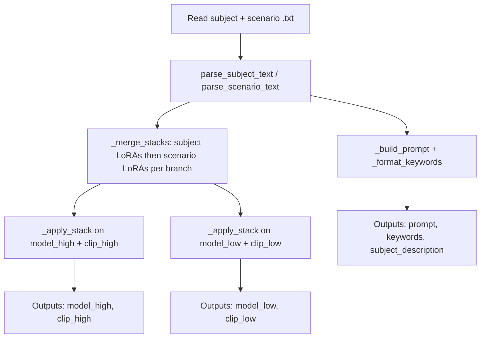

# Lazy Subject + Scene Automation — workflow guide

This document describes **how to use** the Lazy Subject + Scene Automation feature end-to-end, and **how the pieces fit together** in code (Python module, ComfyUI routes, and the browser extension). For full tag syntax, examples, and I/O tables, see [lazy-subject-scene-automation.md](../nodes/lazy-subject-scene-automation.md).

---

## What this feature does (one sentence)

You pick **subject** and **scenario** text files that declare LoRA stacks (with bypass), descriptions, and optional keywords; the node **merges** subject + scenario stacks on each of two branches (**high** / **low**), **applies** them to paired MODEL + CLIP, and outputs a **composed prompt** plus **keywords**—without maintaining separate LoRA chains in the graph for every combination.

---

## Operator workflow (ComfyUI)

### 1. Prepare files on disk

- **Subjects:** `lazy_subject_scene_automation/SubjectFiles/**/*.txt`
- **Scenarios:** `lazy_subject_scene_automation/ScenarioFiles/**/*.txt`

These folders are **not** shared with the standalone Subject/Scenario Selector nodes; copy or symlink if you want the same content in both places.

### 2. Refresh lists when you add files

Dropdowns are built when the node is created or when the server refreshes lists (see [List refresh](#list-refresh)). After adding `.txt` files, press **`R`** in ComfyUI or recreate the node so new relative paths appear.

### 3. Wire the graph

1. Bring **two** model branches (typical Wan-style **high-noise** and **low-noise**) with matching **CLIP** on each branch.
2. Connect **`model_high`** / **`clip_high`** and **`model_low`** / **`clip_low`** into the node.
3. Choose **`subject`** and **`scenario`** from the dropdowns (values are relative paths **without** `.txt`).
4. Optionally wire **`prepend_text`** and **`post_text`** as STRING inputs (there are no multiline boxes on the node itself).
5. Toggle **`pass_subject_to_main_prompt`** if you want the main **`prompt`** to omit the subject file’s description while still exposing it on **`subject_description`**.

### 4. Use outputs downstream

| Output | Typical use |
|--------|----------------|
| `prompt` | CLIP encode, preview text, or text nodes that need the final assembled string. |
| `model_high` / `model_low` | Continue the sampling graph after merged LoRAs. |
| `clip_high` / `clip_low` | Same LoRA order as the paired model branch. |
| `keywords` | Trigger-style tags from subject then scenario `KeywordA`–`KeywordC` blocks, comma-separated with a trailing comma when non-empty. |
| `subject_description` | Raw subject-side description text only (no prepend/post); useful when `pass_subject_to_main_prompt` is off but you still need the subject text elsewhere. |

### 5. Live UI and presets (extension)

When the pack loads **`js/lazy_subject_scene_live.js`**, each **Lazy-subject-and-scene-automation** node shows:

- **Subject file (live)** — read-only mirror of the selected subject `.txt` (via HTTP, no queue run).
- **Scenario file (live)** — same for scenario.
- **`scenario_template`** — editable text **stored only inside preset JSON** when you save; graph execution still reads the scenario file from disk for the **`scenario`** dropdown.

**Load preset:** change **`preset_file`**; the extension POSTs **`load_preset`** and updates dropdowns, live panes, boolean, and template text from the JSON.

**Save preset:** fills `prepend_text` / `post_text` in JSON as empty strings from the current extension (those fields are for API/preset portability; wire them in the graph for real prepend/post during execution).

---

## Execution flow (what happens on each run)

The node’s **`run`** method in `lazy_subject_scene_automation.py` follows this pipeline:

Optional **`prepend_text`**, **`post_text`**, and **`pass_subject_to_main_prompt`** feed **`_build_prompt`** only (they do not change LoRA stacks).

1. **Resolve paths** — `subject` / `scenario` relative paths; `none` or empty skips file read for that side.
2. **Read UTF-8 text** — failures append to `preview_err` and are prefixed onto `prompt` and `subject_description` so you see load errors in the graph.
3. **Parse** — `parse_subject_text` and `parse_scenario_text` return `(high_stack, low_stack, description, keyword_list)` per side. Format is **v2 tagged** if any non-empty line starts with `[`; otherwise **v1** `#`-section legacy rules apply (different high/low mapping for scenario vs subject in v1).
4. **Merge stacks** — `_merge_stacks(subject_slots, scenario_slots)` concatenates: **all subject LoRAs first**, then **all scenario LoRAs**, on each branch.
5. **Apply** — `_apply_stack` walks the merged list with ComfyUI’s **`LoraLoader`**, resolving paths and registering custom LoRA directories when the path exists on disk.
6. **Compose text** — `_build_prompt` interleaves prepend, optional subject description in the main prompt (controlled by the boolean), post text, and scenario description with intentional newlines. `_format_keywords` merges keyword lists.

**Note:** The **`preset_file`** widget is ignored during **`run`**; execution always uses the current **`subject`** / **`scenario`** widget values (and optional STRING inputs). Presets are a **UI snapshot** mechanism.

---

## List refresh

Lists of subjects, scenarios, and presets are refreshed when:

- **`INPUT_TYPES`** runs (node definition / refresh in ComfyUI), which calls `refresh_subjects_list`, `refresh_scenarios_list`, and `refresh_presets_list`.
- HTTP **`GET`** routes under `/vsaan212/lazy-subject-scene/` call the same refresh helpers (used by `js/selectors_refresh.js` and the live extension).

**Seeding:** `_ensure_lazy_seed_txt_files` runs during subject/scenario refresh. If `none.txt` or `Bypass and format example.txt` is missing in either folder, it is **created** from the v2 minimal bypass template. Existing files are **never** overwritten.

---

## Python module sections (`lazy_subject_scene_automation.py`)

Read top-to-bottom, the file groups into these **logical sections**:

| Section (approx. lines) | Responsibility |
|-------------------------|----------------|
| **Module docstring + imports** (1–16) | Describes Wan-style dual-stack purpose; imports `LoraLoader`, `model_management`. |
| **Types + constants** (17–50) | `ApplySlot` tuple type; `_LAZY_V2_STEM_TEMPLATE` for seed files; `LAZY_PRESET_WS_EVENT`; `DEFAULT_SCENARIO_TEMPLATE` for presets and default scenario editor text. |
| **Path safety + I/O helpers** (52–106) | `_normalize_rel_no_ext`, `_is_safe_rel_under_root` (blocks `..`), `_read_txt_under_root`, `_ensure_lazy_seed_txt_files`. |
| **Tag normalization + bypass** (109–127) | `_norm_tag`, `_bypass_path`, `_parse_float` for tagged strengths. |
| **v1 legacy splitting** (130–133) | `_split_v1_sections` on `#`-only separator lines. |
| **v2 tagged parsing** (136–189) | `_is_tagged_format`, `_parse_tagged_blocks` → map of tag → `(body, model_strength, clip_strength)`. |
| **Slot extraction** (192–339) | `_slot_from_block`, `_block_first`, `_append_optional_pair`, `_append_optional_slot`, `_append_primary_subject`, `_append_primary_scenario`, `_subject_stacks_from_blocks`, `_scenario_stacks_from_blocks`, `_keywords_from_blocks`, `_description_from_blocks` — implements slot order, deprecated tag aliases, and Wan 2.1-style “high only” duplication to low with clip strength 1.0. |
| **Public parsers** (362–433) | `parse_subject_text` / `parse_scenario_text`: choose v2 vs v1, return stacks + description + keywords. |
| **Merge + apply** (436–460) | `_merge_stacks`, `_resolve_lora_name`, `_apply_stack` — sequential `LoraLoader.load_lora`. |
| **Prompt + keywords** (463–503) | `_format_keywords`, `_build_prompt` — human-readable spacing rules. |
| **`LazySubjectSceneAutomation` class** (506–796) | Class-level roots and rel path lists; **`refresh_*_list`** scanners; **`api_*`** for HTTP; **`INPUT_TYPES`** / **`run`** ComfyUI integration; **`NODE_*_MAPPINGS`**. |

---

## HTTP API and server integration

Routes are registered in the pack’s **`__init__.py`** when `LazySubjectSceneAutomation` imports successfully:

| Method | Path | Role |
|--------|------|------|
| `GET` | `/vsaan212/lazy-subject-scene/subjects` | Refresh + return sorted subject rel paths (no `.txt`). |
| `GET` | `/vsaan212/lazy-subject-scene/scenarios` | Same for scenarios. |
| `GET` | `/vsaan212/lazy-subject-scene/presets` | JSON `{"presets": [...]}` for JSON files under `Presets/`. |
| `GET` | `/vsaan212/lazy-subject-scene/default_scenario_template` | Returns `DEFAULT_SCENARIO_TEMPLATE` for empty template UI. |
| `POST` | `/vsaan212/lazy-subject-scene/read_pair` | Body `subject` / `scenario` → file texts + errors (path-safe). |
| `POST` | `/vsaan212/lazy-subject-scene/load_preset` | Body `preset` (or legacy `filename`) → preset fields + `read_pair` texts. |
| `POST` | `/vsaan212/lazy-subject-scene/save_preset` | Writes `Presets/{name}.json`; on success refreshes preset list and **`send_sync(LAZY_PRESET_WS_EVENT, {presets})`** so all nodes update **`preset_file`** options. |

---

## Browser extension (`js/lazy_subject_scene_live.js`)

| Piece | Behavior |
|-------|----------|
| **`ensurePresetWsListener`** | Subscribes once to `vsaan212.lazy_subject_scene.presets` and patches every node’s `preset_file` widget values. |
| **`fetchReadPair`** | POST `read_pair` when subject/scenario changes; fills read-only textareas; shows errors inline. |
| **`buildLiveDom`** | Builds the three text areas (subject live, scenario live, editable template). |
| **`onNodeCreated` hook** | Adds DOM widget, chains callbacks on subject/scenario/preset widgets, wires **Save preset** (note: prepend/post sent as empty strings), seeds template from `default_scenario_template` if blank, initial `fetchReadPair`. |

---

## Quick reference: LoRA order on each branch

For both **high** and **low** stacks (separate lists, same tag *names* interpreted per file type):

1. Subject slot A → B → C (skipping bypass / missing optional pairs per `_append_optional_slot` rules).
2. Scenario slot A → B → C.

Cross-file order is always **subject first**, then **scenario**.

---

## See also

- [lazy-subject-scene-automation.md](../nodes/lazy-subject-scene-automation.md) — full input/output table, v1/v2 examples, Wan 2.1 vs 2.2 notes.
- [optional-switch-lora.md](../nodes/optional-switch-lora.md) — single-step bypass semantics aligned with this stack model.
